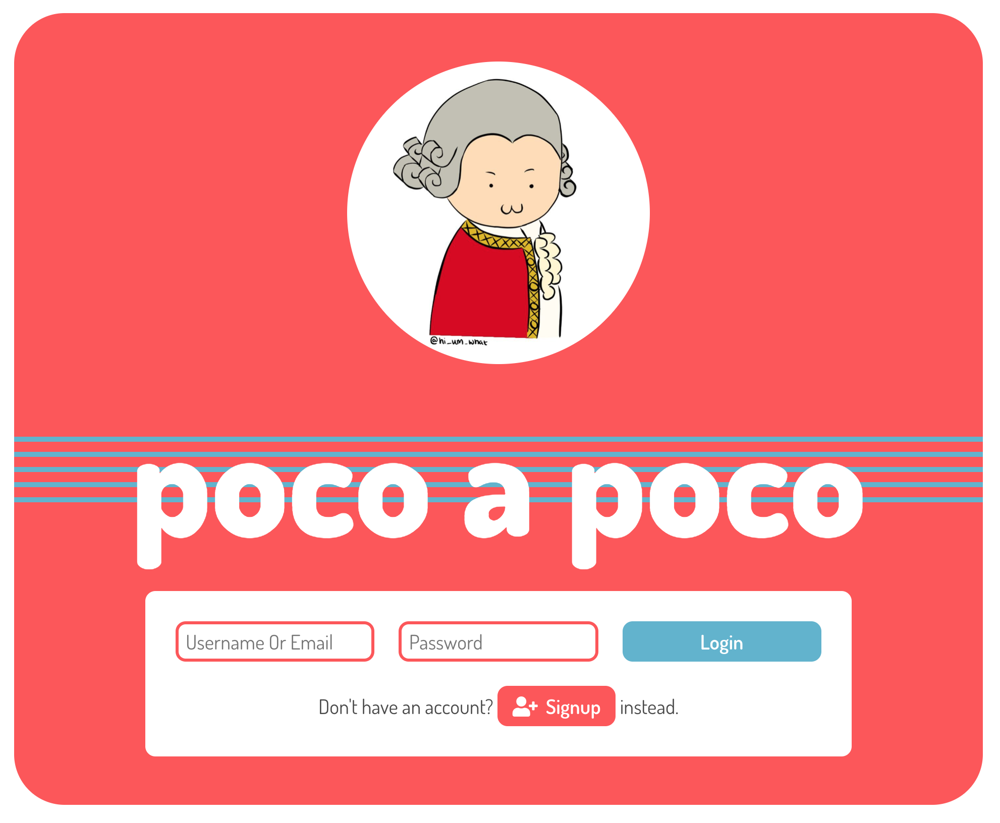
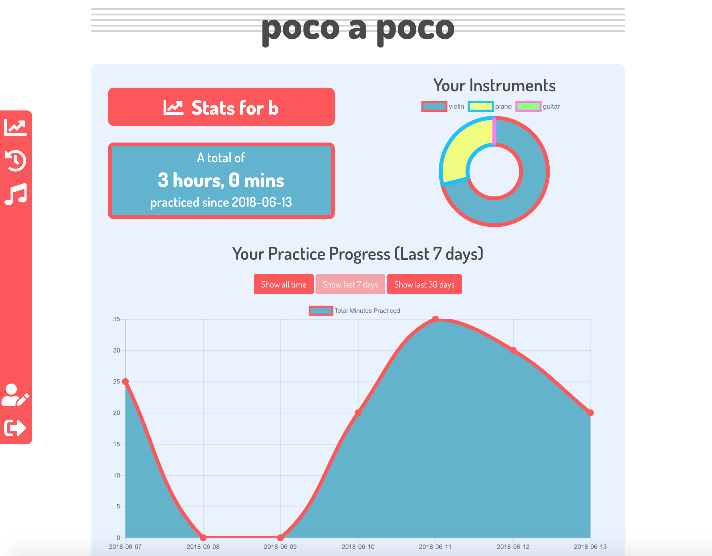
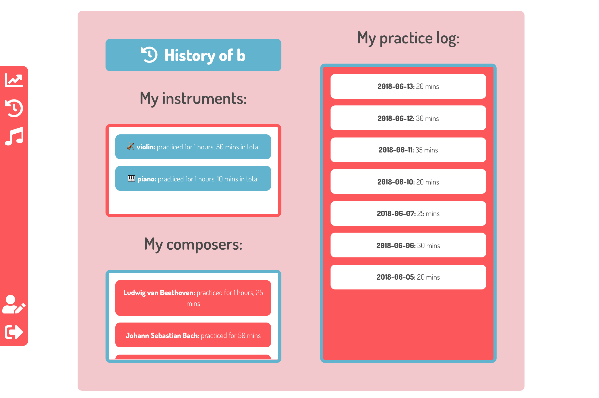
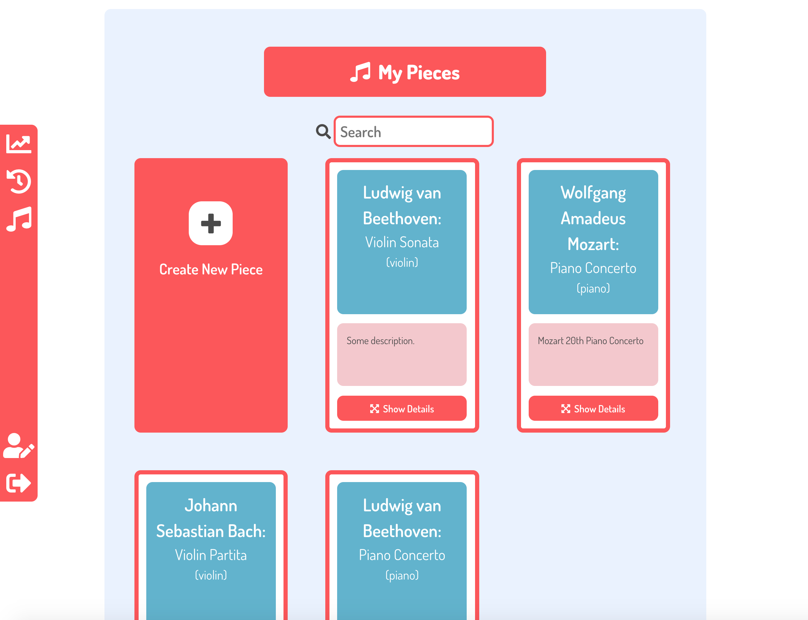
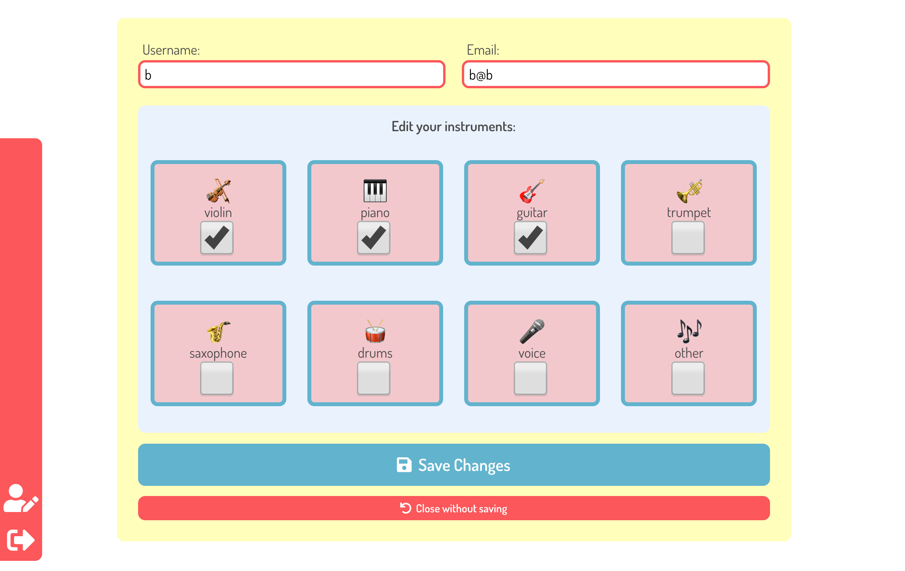
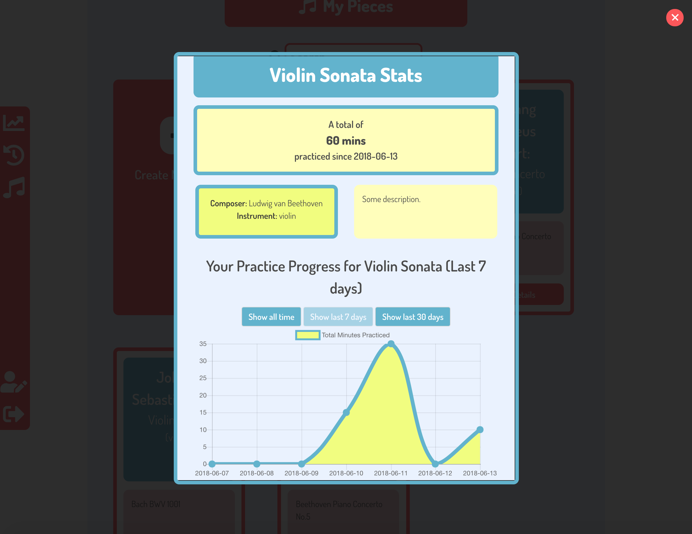
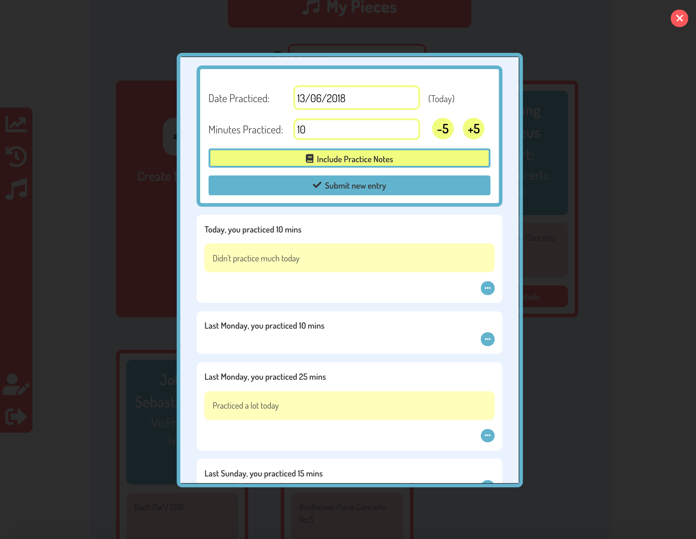

# poco a poco
(1 week individual project)
---



## Table of Contents

* [Links](#links)
* [Description](#description)
* [Technologies Used](#technologies-used)
* [Screenshots](#screenshots)
* [Code Examples](#code-examples)
* [Challenges](#challenges)
* [Wins](#wins)
* [The Future](#the-future)

## Links

* [Heroku](https://poco-a-poco.herokuapp.com/)
* [API Documentation](API.md)

## Description

As a former music student, I am painfully aware of how frustrating practicing can be. When learning new music, or when learning a new instrument, it is extremely easy to become frustrated and discouraged by only seeing what you presently can’t do or how much you haven’t done, losing track and losing perspective on all of the progress you’ve in fact already been making this whole time. This web app aims to help music learners learn better by better keeping track and keeping perspective on their progress.

The app was built using a React.js front-end and a Node.js back-end. I used this project as an opportunity to explore data manipulation in-depth, especially with regards to the use of back-end endpoints and how the back-end should serve the data for the many different ways it is to be displayed and/or visualised in the front-end. I chose Chart.js as a data visualisation library, and found it to be robust and a great visual addition to the app. In order to improve the UX, I also made use of the Wikimedia API for an “autocorrect” feature and Moment.js for date manipulation.

## Technologies Used

* ReactJS
* Node.js (with Express)
* MongoDB (with Mongoose)
* CSS3 (with SASS and BULMA)
* Chart.js
* Moment.js

## Screenshots

Main user dashboard:


Logs of the user's recent activity:


List of the user's pieces:


Edit page for updating the user:


Mini 'dashboard' showing the user's recent progress on each piece:


Screen for inputting practice log data for each piece:


## Code Examples

Here are some of the code snippets in this project that I found the most challenging to write.

_Example 1: A Mongoose virtual on the user model._
```javascript
userSchema
  .virtual('composersLog')
  .get(function () {
    const composersLogObject = {};
    if(this.pieces) {
      this.pieces.forEach(piece => {
        piece.diary.forEach(diaryEntry => {
          if (Object.keys(composersLogObject).includes(piece.composer)) {
            composersLogObject[piece.composer] += diaryEntry.timePracticed;
          } else {
            composersLogObject[piece.composer] = diaryEntry.timePracticed;
          }
        });
      });
      return composersLogObject;
    }
  });
```

In the back end model for the user resource, I made extensive use of virtuals in order to process data that the front end could display that had no reason to be stored in the database anywhere. This virtual in particular was one of the more complex to write, since it required a double `forEach()` to iterate over some arrays inside of an array. Essentially, this was necessary because the `composer` was stored on `user.piece.composer`, whilst the time logged for each piece was stored on `user.piece.diaryEntry.timePracticed`, which required extraction of the data from within the diary entry in order to sum it.

_Example 2: An 'autocorrect' feature._

Front end:
```javascript
handleChange = ({ target: { name, value } }) => {
  this.setState({ editedPiece: { ...this.state.piece, [name]: value }});
  if (name === 'composer' && value) {
    const formattedValue = value.split(' ').join('%20');
    axios
      .get(`/api/wikimedia/composers/${formattedValue}`)
      .then(res => {
        if (res.data.query.redirects) {
          this.setState({ editedPiece: { ...this.state.editedPiece, suggestedComposer: res.data.query.redirects[0].to}});
        } else {
          this.setState({ editedPiece: { ...this.state.editedPiece, suggestedComposer: '' }});
        }
      });
  }
}
```

Back end:
```javascript
const axios = require('axios');

function composers(req, res, next) {
  axios
    .get(`https://en.wikipedia.org/w/api.php?action=query&format=json&titles=${req.params.name}&redirects=1`)
    .then(data => {
      return res.json(data.data);
    })
    .catch(next);
}

module.exports = {
  composers
};
```

In order for the data to be stored meaningfully, it was important that each time the user inputted the name of a composer, it was spelled and formatted consistently - for instance, if the user typed `mozart`, it would be useful if it was consistently autocorrected to `Wolfgang Amadeus Mozart` to prevent confusion. To do this I made use of the Wikimedia API, which has a feature whereby incorrectly spelled article titles are redirected to the correctly spelled ones. This was done through a proxy via the backend, where the user could input anything, and if there was a Wikipedia article titled with a more correctly spelled version of that thing, the app would suggest that instead.

## Challenges

_Challenge 1: UI/UX design_

At the very beginning of the project, I had decided that the whole app should take place on a single URL, which I felt would make the app feel more app-like rather than website-like. This meant placing a lot of the functionality in modals, such as when a user views a piece, adds a piece or adds a diary entry. Until I saw someone else use the app, I hadn't realized how unintuitive this could be - it meant that the user sometimes had to scroll excessively on the single page, and it meant that the user sometimes had to do complex work in a relatively small modal. I feel as though if I were to significantly reorganize the UI I would probably try to make better use of things like tabs, pagination and menus rather than having a lot of the navigation be just scrolling.

_Challenge 2: Responsiveness_

Regrettably, by the end of the week-long project period, I had run out of time to make the app responsive for tablet and mobile. On the whole, the SASS for the app could have been better organized: instead of having to constantly overwrite BULMA's default values on a case-by-case basis, it probably would've been more beneficial to plan out ahead of time and redefine BULMA's variables to suit the styling I wanted at the start and not have to constantly make styling decisions along the way for each tiny thing. I'd actually done almost no styling at all until about 3 days before the end of the project, when the app became so difficult to physically navigate that it was actually slowing down my progress.

## Wins

_Win 1: Complex Data Structures_

Possibly the single most complex part of this project was manipulating the back end's data structures. I had three resources, one of which was embedded inside another. My ideal was to have the user only input very little data, but get a lot of useful analysis in return.

_Win 2: Chart.js_

I was surprised by how much incorporating graphs and charts into my app improved how it looked and how useful it was. It took quite a bit of reading documentation, fishing around for the right library, and manipulating my data to suit the way Chart.js would accept it, but I felt like the charts were what made the app really special. As I have discovered, Chart.js, which in turn is built on D3, is very elegant and customizable, which will make it really useful for any future projects of this kind I might do.

## The Future
